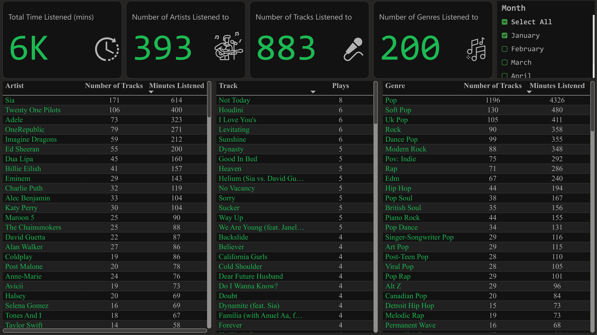
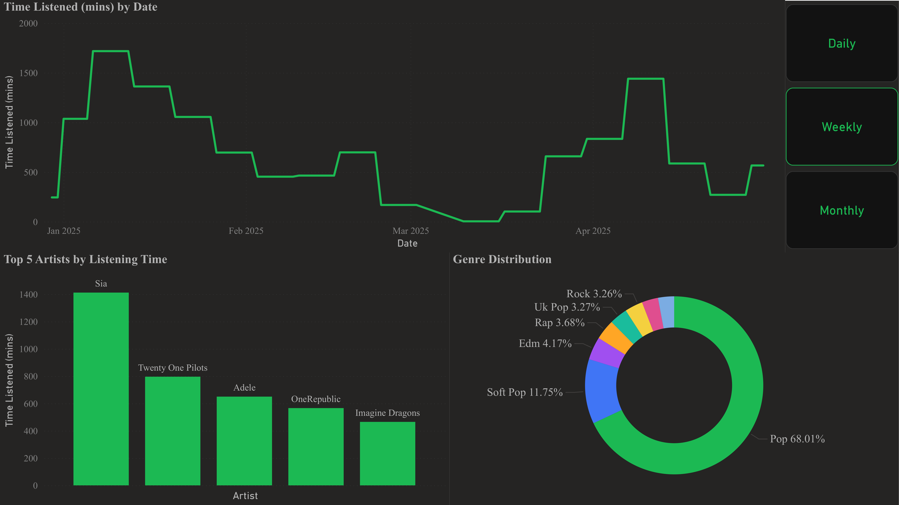
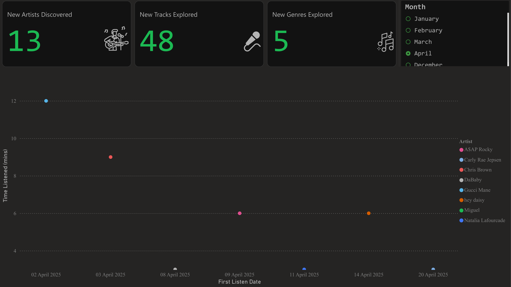
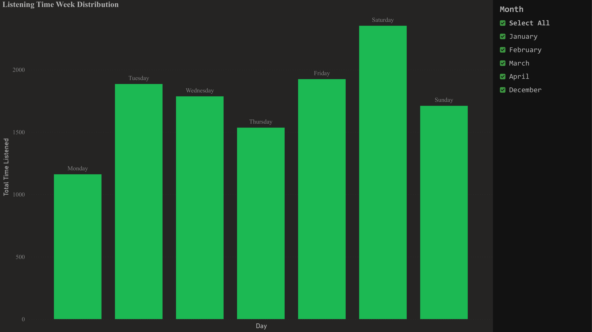
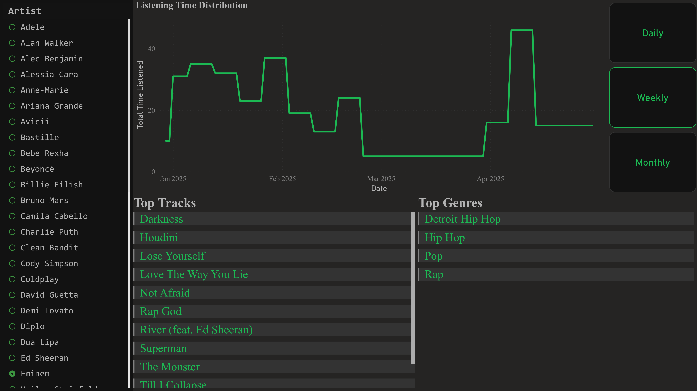
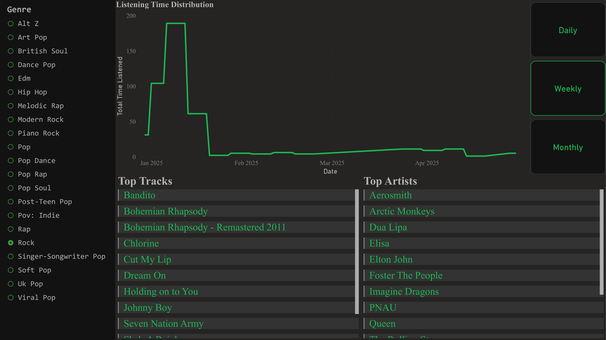

# Spotify Data Unleashed: Your Personal Listening Dashboard ✨

[](https://www.python.org/)
[](https://cloud.google.com/)
[](https://opensource.org/licenses/MIT)

Tired of waiting for Spotify Wrapped once a year? Get **real-time, hyper-detailed insights** into your listening habits with this comprehensive Spotify tracking and visualization project! Go beyond the surface-level stats and truly understand your musical journey.

This project continuously monitors your Spotify activity, processes the data daily, and feeds it into dynamic dashboards (visualized here, but you can build your own!), offering a much richer and more immediate picture than the standard Wrapped summary.
**Demo Video:**  
[▶️ Watch the demo (webm, 720px wide)](demo/spotify_analytics.webm)

## Features 🚀

*   **Minute-by-Minute Tracking:** Captures currently playing songs precisely when you listen.
*   **Automated ETL:** Daily processing aggregates listening time, play counts, and enriches data with **genre information** directly from the Spotify API.
*   **Cloud-Powered:** Leverages Google Cloud Functions for serverless execution and Cloud Scheduler for reliable automation.
*   **Detailed Visualizations:** Provides insights far exceeding Spotify Wrapped, including:
    *   Overall listening time, unique artists, tracks, and genres.
    *   Top artists, tracks, and genres by listening time and play count.
    *   Listening trends over time (daily, weekly, monthly).
    *   Breakdowns by Bands, Duets, Features, and Solo Artists.
    *   New artist/track/genre discovery tracking.
    *   Listening distribution across days of the week.
    *   Artist/Genre specific dashboards.
*   **Persistent Storage:** Uses Google Sheets as a simple, accessible database.

## How It Works ⚙️

The system is built on three core components automated on Google Cloud:

1.  **Tracker (`Tracker\main.py` - Deployed as a Cloud Function):**
    *   **Triggered:** Every minute by Google Cloud Scheduler.
    *   **Action:** Uses `spotipy` to fetch the `current_user_playing_track` via the Spotify API (using OAuth2 with a refresh token).
    *   **Output:** Appends a timestamped row to the "Spotify Data" Google Sheet, including track name, artist, album, and track duration. If nothing is playing (or paused), it appends a row with placeholders (`-`) to signify inactivity, avoiding duplicate pause entries.

2.  **ETL (`Optimizer\main.py` - Deployed as a Cloud Function):**
    *   **Triggered:** Once daily (e.g., shortly after midnight Cairo time) by Google Cloud Scheduler.
    *   **Action:**
        *   Reads data for the *current date* (based on Cairo timezone) from the "Spotify Data" Google Sheet using `gspread` and `pandas`.
        *   Filters out inactive rows (`-`).
        *   Groups data by track, artist, album, and duration to calculate total minutes listened and estimates the number of times each track was played.
        *   **Crucially, it uses `spotipy` again to query the Spotify API for each track/artist combination to retrieve and store associated genres.**
        *   Formats the duration and calculated times.
    *   **Output:** Clears any existing data for the *current date* in the "Spotify Processed Data" Google Sheet and appends the newly transformed and enriched data.

3.  **Visualization (e.g., Google Looker Studio, Power BI, Tableau):**
    *   **Source:** Connects directly to the "Spotify Processed Data" Google Sheet.
    *   **Action:** You build dashboards and charts to visualize the processed data, similar to the examples provided.

## Dashboard Showcase 📊

**Overview & Top Lists:** Get a high-level summary and see your most played content.  


**Time Trends & Genre Distribution:** Understand your listening patterns over time.  


**Artist Type Breakdown:** See your preferences for Bands, Duets, Features, and Solo artists.  


**Discovery:** Track when you first listened to new artists.  


**Weekly Patterns:** Find out which days you listen the most.  


**Artist/Genre Deep Dive:** Filter and explore specific artists or genres.  



## Technical Stack 🛠️

*   **Language:** Python 3
*   **Core Libraries:**
    *   `spotipy`: Spotify API interaction.
    *   `gspread` & `oauth2client`: Google Sheets interaction.
    *   `pandas`: Data manipulation in ETL.
    *   `pytz`: Timezone handling.
    *   `functions-framework`: For Google Cloud Functions deployment.
*   **Platform:** Google Cloud Platform (GCP)
    *   Cloud Functions: Serverless compute for Tracker and ETL.
    *   Cloud Scheduler: Cron-like job scheduling.
*   **Database:** Google Sheets
*   **Visualization:** Google Looker Studio (recommended) or any tool that can connect to Google Sheets.

## Setup Instructions 🛠️

1.  **Prerequisites:**
    *   Python 3.8+ installed.
    *   A Google Cloud Platform account with billing enabled.
    *   A Spotify account and a registered Spotify Developer application.

2.  **Clone the Repository:**
    ```bash
    git clone https://github.com/MostafaKotb19/Spotify-Analytics.git
    cd Spotify-Analytics
    ```

3.  **Spotify Setup:**
    *   Go to the Spotify Developer Dashboard: [https://developer.spotify.com/dashboard/](https://developer.spotify.com/dashboard/)
    *   Create a new application.
    *   Note down your `Client ID` and `Client Secret`.
    *   Edit the settings: Add a **Redirect URI**. You can use `https://example.org/callback` for this setup (it doesn't need to be a live URL for the refresh token retrieval).
    *   **Get Refresh Token:**
        *   Fill in your `CLIENT_ID`, `CLIENT_SECRET`, and `REDIRECT_URI` in `refresh_token_retriever.py`.
        *   Run the script: `python refresh_token_retriever.py`
        *   It will print a URL. Open it in your browser, log in to Spotify, and authorize the application.
        *   You'll be redirected to your `REDIRECT_URI` (e.g., `https://example.org/callback`) with a `?code=...` parameter appended.
        *   Copy the **entire** redirected URL (including the `code`) and paste it back into the terminal when prompted by the script.
        *   The script will print your `Access Token` and **`Refresh Token`**. **Save the `Refresh Token` securely!**

4.  **Google Cloud & Sheets Setup:**
    *   In your GCP Console:
        *   Create a new project or select an existing one.
        *   Enable the following APIs: Cloud Functions API, Cloud Scheduler API, Google Drive API, Google Sheets API.
        *   Create a Service Account: Go to IAM & Admin > Service Accounts > Create Service Account. Give it a name (e.g., `spotify-sheets-updater`).
        *   Grant Roles (optional but recommended for clarity): Grant it "Cloud Functions Invoker" if you want to restrict scheduler triggers, and potentially "Editor" role for Sheets/Drive if needed, though sharing the sheet directly is often sufficient.
        *   Create a Key for the Service Account: Select the service account, go to the "Keys" tab, click "Add Key" > "Create new key", choose JSON, and download the file. Rename this file to `sheets.json` and place it in the root of your cloned repository.
    *   Create two Google Sheets:
        *   Name one "Spotify Data".
        *   Name the other "Spotify Processed Data".
        *   Open the "Spotify Data" sheet and add the following headers in the first row: `Timestamp`, `Track`, `Artist`, `Album`, `Duration`.
        *   **Share both sheets:** Click the "Share" button on each sheet and add the Service Account's email address (found in the `client_email` field inside `sheets.json`) as an Editor.

5.  **Configuration:**
    *   Rename the two `main.py` files for clarity, e.g., `tracker_main.py` and `etl_main.py`. *Make sure the corresponding Cloud Function deployments use the correct file.*
    *   Open `tracker_main.py` (or your renamed tracker file) and `etl_main.py` (or your renamed ETL file).
    *   Replace `"YOUR_CLIENT_ID"`, `"YOUR_CLIENT_SECRET"`, and `"YOUR_REFRESH_TOKEN"` with the actual values obtained from Spotify Developer Dashboard and the `refresh_token_retriever.py` script.
    *   Ensure `REDIRECT_URI` matches the one set in the Spotify App settings.
    *   Ensure `CREDENTIALS_FILE = "sheets.json"` is correct.
    *   Ensure `INPUT_SHEET_NAME` and `OUTPUT_SHEET_NAME` match the names of your Google Sheets.

6.  **Create `requirements.txt`:**
    ```
    functions-framework
    spotipy
    gspread
    oauth2client
    pandas
    pytz
    ```

7.  **Deploy Cloud Functions:**
    *   In your GCP Console, go to Cloud Functions.
    *   **Deploy Tracker Function:**
        *   Click "Create Function".
        *   Name: `spotify-tracker`
        *   Runtime: Python 3.8+ (or the latest available version).
        *   Trigger type: HTTP.
        *   Source code: Inline editor.
        *   Entry point: `main` (or the function name in your tracker file).
        *   Paste the contents of `tracker_main.py` into the inline editor.
        *   Click "Deploy".
    *   **Deploy ETL Function:**
        *   Repeat the above steps for the ETL function, naming it `spotify-etl` and using `etl_main.py` as the source.
        *   Ensure the entry point is set to `main` (or the function name in your ETL file).

8.  **Setup Cloud Scheduler:**
    *   Go to Cloud Scheduler in the GCP Console.
    *   **Create Tracker Job:**
        *   Name: `spotify-tracker-cron`
        *   Frequency: `* * * * *` (Every minute using unix-cron format)
        *   Timezone: Select yours (e.g., `Africa/Cairo`)
        *   Target type: `HTTP`
        *   URL: Paste the HTTP Trigger URL for your `spotify-tracker` function.
        *   HTTP method: `GET` (or `POST` if your function expects it)
    *   **Create ETL Job:**
        *   Name: `spotify-etl-daily`
        *   Frequency: `59 23 * * *` (e.g., Every day at 23:59)
        *   Timezone: `Africa/Cairo` (or your target timezone for daily processing)
        *   Target type: `HTTP`
        *   URL: Paste the HTTP Trigger URL for your `spotify-etl` function.
        *   HTTP method: `GET` (or `POST`)

## Usage 🎧

Once set up:

1.  The system runs automatically in the background.
2.  Listen to Spotify as usual.
3.  Your raw listening data populates the "Spotify Data" sheet every minute (when playing).
4.  The "Spotify Processed Data" sheet updates daily with aggregated and enriched data.
5.  Open your dashboard (e.g., in Looker Studio) to view your up-to-date listening insights!

## Important Considerations

*   **Costs:** While GCP offers a generous free tier, heavy usage of Cloud Functions and associated network egress could potentially incur small costs. Monitor your usage.
*   **Error Handling:** The provided code includes basic error handling, but you might want to enhance it (e.g., add retries, dead-letter queues, notifications on failure).

## Contributing

Contributions are welcome! Feel free to open issues or submit pull requests for improvements, bug fixes, or new features.